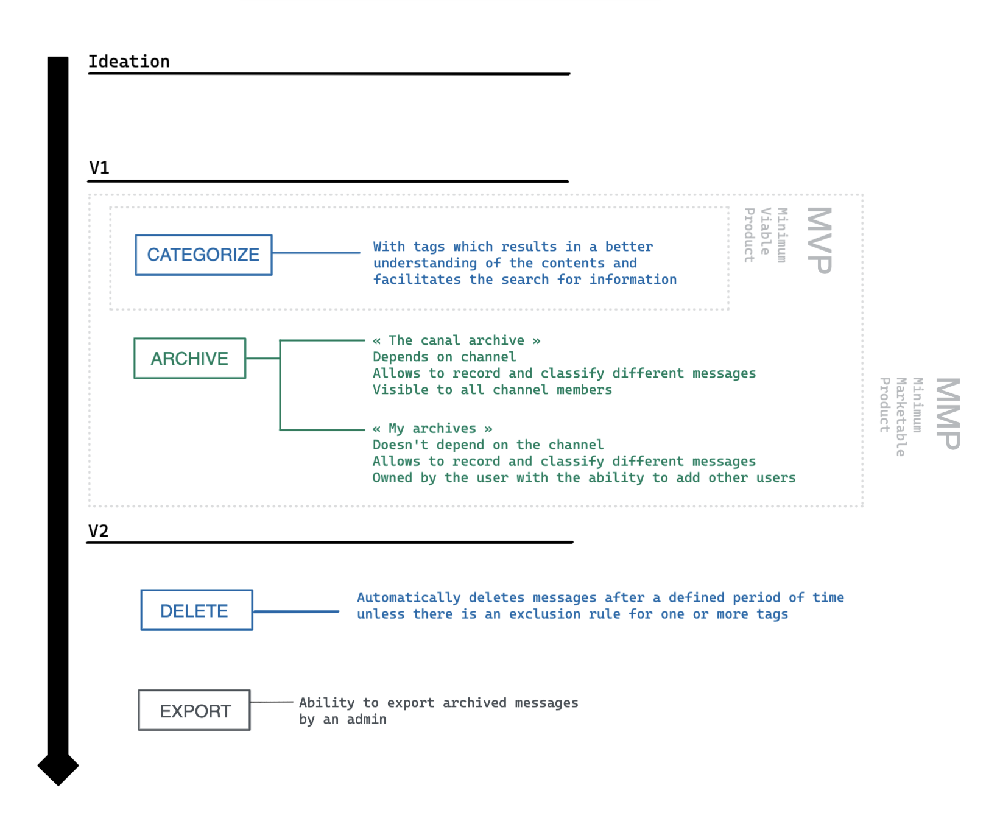
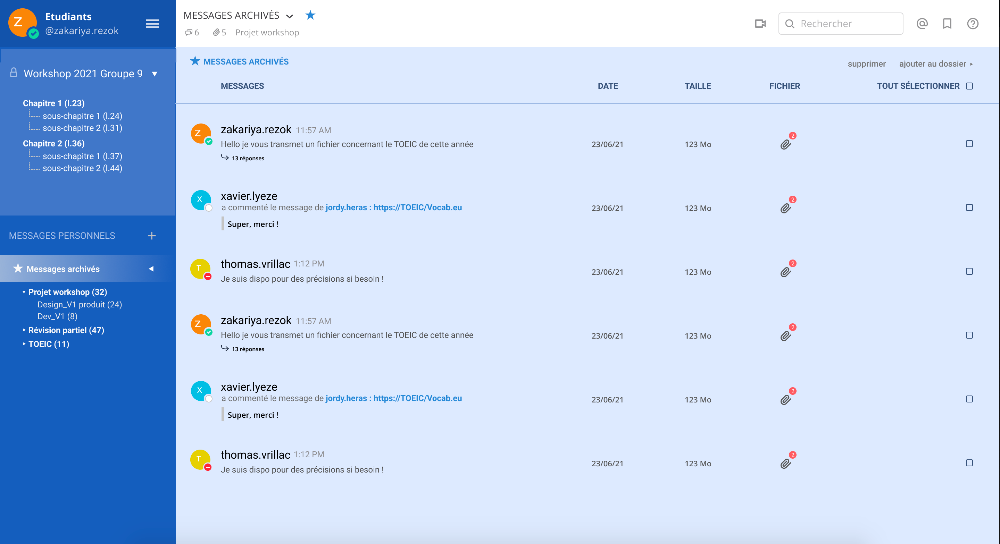
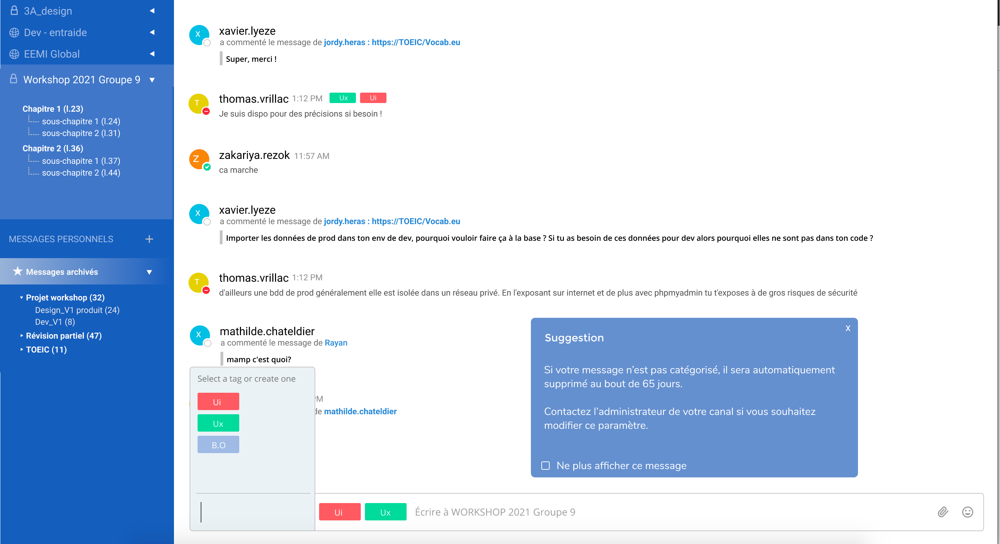

# Plugin Archiv'It


## Authors
Ce plugin a été développé par notre équipe, composé de 7 étudiants : 
>
- Alizée GILLOUAYE - alizee.gillouaye@eemi.com
- Jordy HERAS - jordy.heras@eemi.com
- Mathieu LIENARD - mathieu.lienard@eemi.com
- Paul ANDRE - paul.andre@eemi.com
- Thomas VRILLAC - thomas.vrillac@eemi.com
- Xavier IYEZE - xavier.lyeze@eemi.com
- Zakariya REZOK - zakariya.rezok@eemi.com

## Purpose
Ce plugin dédié à Mattermost, a pour objectif principal de simplifier l’utilisation des services de messagerie en permettant l’archivage et l'accès rapide aux informations pertinentes dans une logique d'amélioration de productivité. 

Par ailleurs, notre équipe projet vient de finaliser la phase d'idéation. Pour cette raison, seul le squelette du plugin a été développé pour l'instant. 

Voici notre Roadmap :




Nos travaux s’inscrivent dans un projet open-source communautaire. C'est pourquoi, nous sommes ouverts à toutes contributions via notre repository. 

À savoir, que nous aimerions à terme, le rendre déployable sur d'autres services de messagerie tels que Slack, Teams, ou encore Discord. 

Si vous souhaitez contacter un membre de notre équipe, n'hésitez pas à envoyer un mail à un membre.


## Contexte : problématique

De nos jours, nous sommes noyés sous un flot massif d'information. Il est ainsi, difficile de savoir distinguer l'information pertinente parmi celles qui le sont moins. Une maîtrise des flux de données que nous recevons est alors essentiel afin de ne pas se retrouver submergé.

Cette surcharge d'information appelé infobésité s'exprime par un trop-plein ressenti dès lors que nous n'arrivons plus à assimiler les informations convenablement. Cette surcharge se traduit par l'assimilation d’un volume conséquent d’informations en peu de temps. Très souvent, cela génère un sentiment de stress et de pression chez le lecteur. Cela affecte donc notre efficacité et notre productivité. 

Classer, trier, filtrer, voici trois mots qui caractérisent notre volonté de lutter contre la surcharge informationnelle.


## Fonctionnalités


### Fonction d’archivage

L'archivage est un ensemble d'actions qui a pour but de garantir l'accessibilité sur le long terme d'informations. Cette fonction consiste en la possibilité d'enregistrer et classer différents messages. Ceux-ci seront immédiatement listés dans un espace réservé. Les fonctionnalités permettant de classer, trier et archiver sont disponibles pour l'ensemble des utilisateurs. 


Il existe deux types d'espaces permettant de classer les messages archivés :

 - « L’archive du canal » est un espace dépendant d’un canal. Il est dédié aux messages enregistrés par le ou les admins du canal. Cette archive est spécifique au canal dans laquelle elle a été enregistrée. L’ensemble des utilisateurs faisant partie du canal sont en mesure d’y accéder.

- « Mes archives » est un espace personnel indépendant des canaux, dédié aux messages pour chaque utilisateurs qui permet également d'enregistrer et classer différents messages. Il est possible d’inviter d’autres membre du serveur Mattermost à accéder et rejoindre cet espace. 


→ Facilite le partage des ressources et la recherche d’information.  




### Fonction de catégorisation


Cette fonctionnalité a pour vocation de donner la possibilité aux utilisateurs de pouvoir catégoriser un message lors de son envoi. Lorsque l'utilisateur entre son message, il lui est proposé de choisir un tag suggéré ou bien de créer le sien.

→ Meilleur compréhension des contenus
→ Facilite la recherche d’information 

À noter que si un tag est défini sur un message, l'ensemble des messages suivants et sous-jacents appartiendront au tag choisi précédemment. 

Ainsi, si l'utilisateur souhaite changer de sujet, il devra tout simplement modifier le ou les tags associés à son message. 




### Fonction de suppression automatique

La catégorisation du message est optionnelle, cependant par défaut, si le message ne possède pas de tag, il s'expose à un retrait de la plateforme au bout d'un temps défini. Le ou les administrateurs des canaux auront la possibilité de définir une règle qui va permettre de supprimer les messages après un laps de temps personnalisable suivant les tags souhaités. 

Cette fonction de suppression automatique va donc de paire avec la catégorisation.  

→ Réduction de l’empreinte énergétique/carbone
→ Répondre aux contraintes de stockage  
→ Suppression des messages sans importance


### Fonction d'export

Cette fonctionnalité consiste à exporter une conversation ou bien une partie de celle-ci. Cette fonction est réservée aux administrateurs du canal et permet d'archiver un échange sur la plateforme. Chaque message est signé électroniquement pour garantir l’intégrité des données et l’authenticité de l’expéditeur du message. 

À noter que lorsqu'un message est modifié, ce changement est indiqué par le statut "Édité" ou "Modifié". Ainsi, lorsqu'une conversation est exporté il est possible de voir les différents changements effectués.
                                                           
→ Possibilité de sauvegarde global (backup)
→ Possibilité de sauvegarder les messages susceptible d'être supprimés par la fonction de supression automatique (backup)
→ Possibilité de régler des ligites (Ressources humaines, relation client)


## Technologies choisies

- Front-end: React (JavaScript)
- Back-end: Golang
- Pour déployer en local: Docker

## Etat du code 
Le squelette a été mis en place en back-end, ainsi que les classes nécessaires pour la création de tags et d'archives.
De plus, nous avons également développé un composant React permettant d'afficher un message dans la console.

## How to install on Mattermost

### Installation

### Minimum requis

Installation Docker
Installation Golang
Installation React

### Création d'une serveur local 
Il est recommandé de créer un serveur en local afin de tester le plugin.
Pour cela, il est nécessaire d'utiliser docker, afin que toutes les dépendances, bases de données et autres soient bien installées directement. 

Suivez les étapes suivantes :
```
$ docker run --name mattermost-preview -d --publish 8065:8065 --add-host dockerhost:127.0.0.1 mattermost/mattermost-preview
```

Vous avez maintenant accès à un serveur local Mattermost via l'URL suivante :
http://localhost:8065/

**N'oubliez pas de créer un premier user pour l’espace d'administration.** 

Pour créer et ajouter un plugin à Mattermost, suivez les étapes suivantes :
- Dans le menu, aller dans : System Console > Plugin Management 
- Puis importer le plugin sous forme de dossier compressé dont l’extension est .tar.gz. 

À présent, il faut activer le plugin, en bas de la page pour que celui-ci s’ajoute au site internet.

Pour commencer à créer le plugin, nous vous recommandons d'utiliser le template mis à disposition par Mattermost:
https://github.com/mattermost/mattermost-plugin-starter-template. 

Enfin, il ne reste plus qu’à build le plugin pour l’exporter.
Pour effectuer cela dans le terminal, aller dans le dossier du projet puis entrer les commandes suivantes :
```
$ brew install golangci-lint
$ make
```
